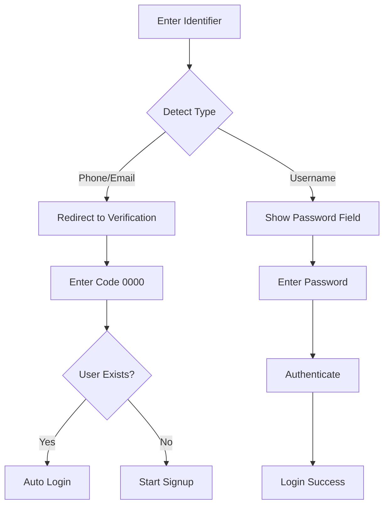
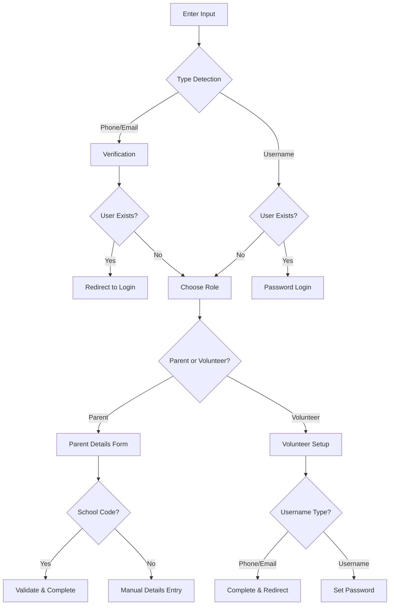

# REACH Authentication System Documentation

## Overview

The REACH Hong Kong platform features a unified authentication system that supports multiple input methods (phone, email, username) with smart detection, verification flows, and persistent user storage. This system is designed to provide a seamless user experience while maintaining security and data persistence.

## Architecture

### Core Components

1. **AuthContext** (`/contexts/auth-context.tsx`)
   - Central authentication state management
   - User session handling
   - localStorage integration for persistence
   - Mock authentication for development

2. **Login Page** (`/app/login/page.tsx`)
   - Unified input field with smart detection
   - Conditional password field (username only)
   - Automatic flow routing

3. **Signup Page** (`/app/signup/page.tsx`)
   - Multi-step signup process
   - Verification flow for phone/email
   - Role-based registration

## Authentication Flow

### 1. Unified Input Detection

The system automatically detects input type based on format:

```typescript
// Phone: 8 digits
/^\d{8}$/.test(value) // e.g., "12345678"

// Email: standard email format
/^[^\s@]+@[^\s@]+\.[^\s@]+$/.test(value) // e.g., "user@example.com"

// Username: anything else
// e.g., "myusername"
```

### 2. Login Flow

#### For Phone/Email:
1. User enters phone/email
2. System redirects to signup page for verification
3. Verification code sent (mock: always `0000`)
4. After verification:
   - If user exists → Auto-login
   - If user doesn't exist → Proceed to signup

#### For Username:
1. User enters username
2. Password field appears
3. Standard username/password authentication



### 3. Signup Flow

#### Multi-Step Process:

1. **Input Step**: Enter phone/email/username
2. **Verification Step**: For phone/email only (code: `0000`)
3. **Role Selection**: Choose Parent or Volunteer
4. **Details Collection**: Based on role and input type
5. **Completion**: Account created and logged in

#### Role-Specific Flows:

**Parent Signup:**
- Optional school code field
- If school code provided → Quick registration
- If no school code → Manual entry (parent name, student name, school name)

**Volunteer Signup:**
- Phone/Email → Direct completion → Redirect to login
- Username → Password creation → Account created



## Data Storage

### User Data Structure

```typescript
interface User {
  id: string
  username: string
  email?: string
  phone?: string
  studentName?: string    // For parents
  parentName?: string     // For parents
  school?: string         // For parents
  role: 'parent' | 'volunteer' | 'admin'
  createdAt: string
}

interface MockUser extends User {
  password: string  // Stored separately for security
}
```

### localStorage Keys

- `mock_users`: Array of all registered users (including passwords)
- `auth_user`: Current authenticated user (without password)
- `auth_token`: Authentication token

### Persistence Strategy

1. **Default Users**: System starts with predefined test users
2. **New Registrations**: Added to localStorage immediately
3. **Cross-Session**: Users persist across browser sessions
4. **Conflict Prevention**: Fresh data loaded before operations

## Testing Credentials

### Default Test Users

| Username | Email | Phone | Password | Role |
|----------|--------|--------|----------|------|
| `testuser` | `test@example.com` | - | `test123` | parent |
| `phone_user` | - | `12345678` | `phone123` | parent |
| `volunteer_user` | `volunteer@example.com` | - | `volunteer123` | volunteer |
| `admin_user` | `admin@example.com` | - | `admin123` | admin |

### Test Values

- **Verification Code**: `0000` (always accepted)
- **Valid School Code**: `SCHOOL123`
- **Phone Format**: 8 digits (e.g., `12345678`)

## Debug Features

### Console Logging

The system provides comprehensive debug logging with emoji prefixes:

- `🔍 [AUTH]`: Data loading/saving operations
- `🔐 [LOGIN]`: Login process steps
- `📝 [SIGNUP]`: Signup process steps
- `🔐 [VERIFICATION]`: Verification flow
- `🚪 [LOGOUT]`: Logout operations
- `🗑️ [DEBUG]`: Debug operations

### Debug Commands

```javascript
// View all stored users
JSON.parse(localStorage.getItem('mock_users'))

// View current session
JSON.parse(localStorage.getItem('auth_user'))

// Clear stored users (via auth context)
// auth.clearStoredUsers()
```

## Security Features

### Password Handling

- Passwords stored separately from user data
- Special "verified_user" password for phone/email verification
- No plain text password exposure in logs

### Session Management

- JWT-style tokens (mock implementation)
- Automatic session restoration
- Secure logout with data cleanup

### Input Validation

- Format validation for phone/email
- Duplicate user prevention
- Required field validation

## Error Handling

### Common Error Scenarios

1. **Invalid Credentials**: User not found or wrong password
2. **Duplicate Registration**: User already exists
3. **Verification Failure**: Wrong verification code
4. **Network Simulation**: Artificial delays for testing

### Error Display

- User-friendly error messages
- Console logging for debugging
- Alert notifications for critical errors

## API Integration Points

### Current Mock Functions

```typescript
// User existence check
mockCheckUserExists(value: string, type: InputType): Promise<boolean>

// School code validation
mockValidateSchoolCode(code: string): Promise<boolean>

// Authentication simulation
login(credentials: LoginCredentials): Promise<void>
signup(userData: SignupData): Promise<void>
```

### Future API Integration

To integrate with a real backend, replace mock functions with actual API calls:

1. Replace `mockCheckUserExists` with `/api/users/check`
2. Replace `mockValidateSchoolCode` with `/api/schools/validate`
3. Replace localStorage with secure token storage
4. Add proper error handling for network failures

## File Structure

```
frontend/
├── contexts/
│   └── auth-context.tsx          # Central auth state management
├── app/
│   ├── login/
│   │   └── page.tsx              # Login page with unified input
│   ├── signup/
│   │   └── page.tsx              # Multi-step signup process
│   └── forgot-password/
│       └── page.tsx              # Password recovery
└── docs/
    └── AUTH_SYSTEM.md            # This documentation
```

## Development Workflow

### Adding New Users

1. Users can register through the signup flow
2. Data persists in localStorage automatically
3. Users can log in immediately after registration

### Testing Authentication

1. Use provided test credentials
2. Monitor console logs for detailed flow tracking
3. Use browser dev tools to inspect localStorage

### Debugging Issues

1. Check console logs with emoji prefixes
2. Verify localStorage data structure
3. Clear stored users if data becomes corrupted
4. Use test credentials for consistent testing

## Future Enhancements

### Planned Features

1. **Email/SMS Integration**: Real verification codes
2. **Password Recovery**: Forgot password functionality
3. **Social Login**: Google/Facebook integration
4. **Multi-Factor Authentication**: Additional security layer
5. **Session Expiry**: Automatic logout after inactivity

### Backend Integration

1. **JWT Tokens**: Replace mock tokens with real JWT
2. **API Endpoints**: Replace mock functions with REST calls
3. **Database Storage**: Replace localStorage with server storage
4. **Security Headers**: Add CSRF protection and secure headers

## Troubleshooting

### Common Issues

**Q: User can't log in after signup**
A: Check console logs, verify user was saved to localStorage

**Q: Verification code not working**
A: Use test code `0000`, check console for detailed flow

**Q: Password field not showing**
A: Ensure input is detected as username, not phone/email format

**Q: Data not persisting**
A: Check browser localStorage support, verify no private browsing

### Reset Instructions

```javascript
// Clear all data and start fresh
localStorage.clear()
// Refresh the page
location.reload()
```

---

*Last Updated: November 2024*
*Version: 1.0*
*Maintained by: REACH Development Team*
